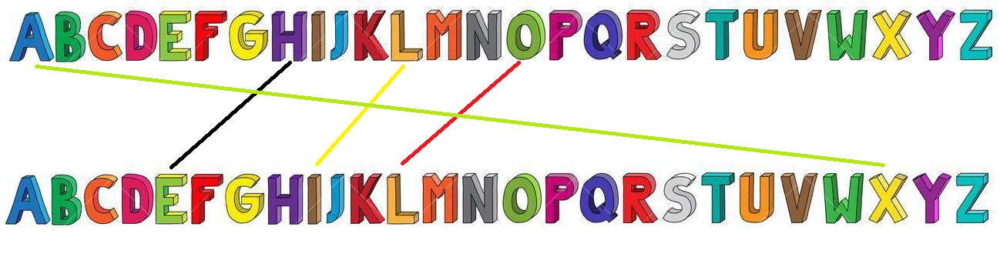
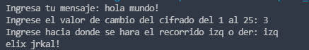
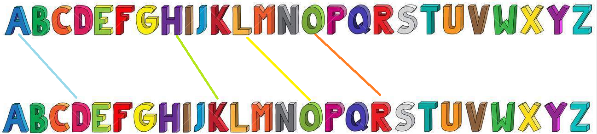
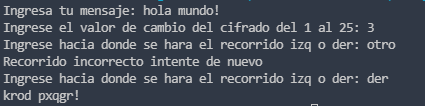

# Cifrado Cesar Python
## Que es?
La acción de un cifrado César es reemplazar cada letra de texto plano por una diferente, un número fijo de lugares en el alfabeto.

El cifrado ilustrado aquí utiliza un desplazamiento a la izquierda de tres, de modo que (por ejemplo) cada aparición de E en el texto plano se convierte en B en el texto cifrado.

## Codigo encriptacion

Para nuestro programa elaboraremos un cifrado sencillo que solo recorra una sola letra, cada letra del mensaje se reemplaza por su consecuente más cercano (A se convierte en B, B se convierte en C, y así sucesivamente). La única excepción es Z, la cual se convierte en A.

Se utilizaran los siguientes supuestos:
* Solo acepta letras latinas (nota:los romanos no usaban espacios en blanco ni dígitos).

* Todas las letras del mensaje están en mayúsculas (nota: los romanos solo conocían las mayúsculas).

### Codigo
* [encriptado](encriptado.py)

* [desencriptado](desencriptado.py)

## Codigo de encriptacion mejorado
El cifrado solo recorre una posicion pero podemos mejorar este recorrido para obtener un cifrado mejor y personalizado para que el usuario puede desplazar en un rango del 1 al 25.

Además, dejemos que el código conserve las mayúsculas y minúsculas (las minúsculas permanecerán en minúsculas) y todos los caracteres no alfabéticos deben permanecer intactos.

Las caracteristicas de mejora del programa son las siguientes:
* Pida al usuario una línea de texto para encriptar.
* Pida al usuario un valor de cambio (un número entero del rango 1 al 25, nota: se debe obligar al usuario a ingresar un valor de cambio válido.
* Pida al usuario un recorrido izquierda o derecha
* Imprimir el texto codificado.

### Codigo
[encriptado_mejorado](encriptado_mejorado.py)
### Prueba del codigo
Haremos una prueba sencilla de la frase "hola mundo!" con un rango de 3 para ambos recorridos

#### Recorrido izquierda
Todo lo que no sea letra se conservara incluidos espacios y otros caracteres.

Se muestra una imagen del recorrido deseado de acuerdo al rango de prueba para la primer palabra hola recorriendo 3 espacios hacia la izquierda cada letra y el resultado en codigo.

#### Recorrido derecha
El mismo mensaje y rango pero con la diferencia que supondremos que el usuario se equivoca y no cumple con los requisitos descritos del programa.

Recorrido deseado

Tengo la consideracion del que se podria mejorar y optimizar para otros requerimientos del usuario, ademas de que tratar los errores podria ser de gran utilidad para prevenir encriptacion erronea.
